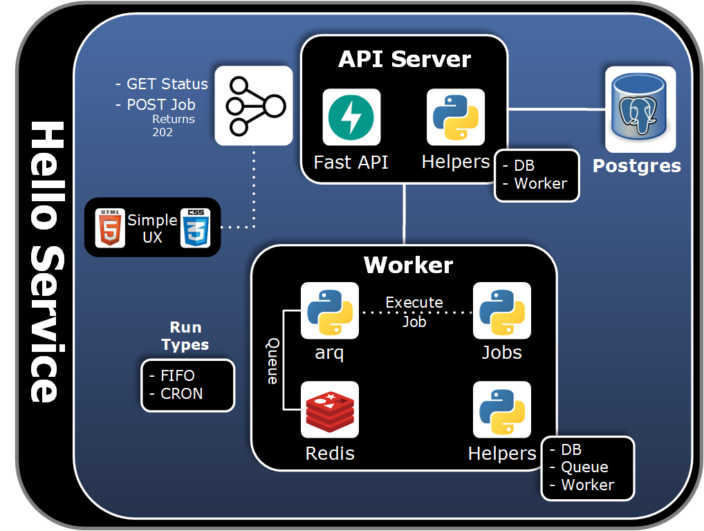

# async-service

A pythonic template repo for API based services that needs async workers for non blocking jobs. By Default the worker will automatically execute the async non blocking jobs managed by a Queue using a first in first out methodology. Optionally, one can also use a cron like settings for jobs. The worker is separated from the API server to manage different concerns. It comes with helpers and uses a queue for durability and workflow control. Redis is the persistance layer for the queue. It has a simple client helper for direct redis access. However, the opinion is to use arq as the primary interface for most worker related things.

A simple dynamic Html5 app with CSS to view job status is included. An RDBMS with helpers is also included to support jobs that need a relational database. A sample hello job is included in the repo. When the hello job is submitted it will insert a record to the data base. The job is asserted by both API and Cron Run Types. Cron job is running every 10 seconds on startup.

When submitting jobs via an API, it is the clients responsibility to create a unique job id for each instantiation of a function. If a duplicate job id is used the api will return a 409. This is to ensure the client is at least attempting to have some intention about every job submission and prevents some accidental duplicate jobs and deter some DDOS threats.

By default this template repo will only save redis keys for 4 hour to maintain sane use of local resources. By design not all tox test will pass after the keys expire. Execute `make down` & `make up` again to refresh when wanting tests to pass and the containers have been up for greater than 4 hours. When using the repo as a template decide how long the keys should be kept for the service and how to manage that in production. Cron DB keys will be deleted every hour via a delete cron job included as part of the service by default.



## Prerequisites

Review [Local Development](https://github.com/sunlao/async-service/wiki) Mac Pre-Req and Virtual Environments:

* Virtual Environment
* containers
* postgres

Locally this repo uses the following environment variables in a `.env`

* APP_CODE=aserv
* API_STATIC_DIR=/app/src/api/static
* ENV=dev
* DB_NAME=db_${APP_CODE}
* DB_ADMIN_USER=${APP_CODE}_admin
* DB_HOST_PORT=5431
* DB_CONTAINER_PORT=5432
* DB_CONTAINER_HOST=${APP_CODE}-postgres
* REDIS_HOST=${APP_CODE}-redis
* REDIS_HOST_PORT=6378
* REDIS_CONTAINER_PORT=6379
* DB_ADMIN_PWD={manually create a unique secret}
* DB_DATA_PWD={manually create a unique secret}
* DB_APP_PWD={manually create a unique secret}

Note: we do not store passwords in repos so `.env` files are in the `.gitignore` file

## Local Development

```SHELL
make up
```

```SHELL
docker ps 
```

Deploys the following containers:

* aserv-api
* aserv-db-deploy
* aserv-redis
* aserv-postgres
* aserv-worker

Note: aserv-db-deploy is down after the db deploy is finished. Check logs with:

```SHELL
docker logs aserv-db-deploy 
```

Destroy the above running containers with:

```SHELL
make down
```

### Tech Stack

* Requirements files:
  * `requirements.txt`
* API - [Fast API](https://fastapi.tiangolo.com/)
* DB Schema Deployment - [Flyway](https://documentation.red-gate.com/fd)
* Worker:
  * Queue
    * [arq](https://arq-docs.helpmanual.io/)
    * [blog](https://threeofwands.com/the-inner-workings-of-arq/)
  * Storage
    * [Redis](https://redis.io/docs/)
    * [blog](https://realpython.com/python-redis/)
* RDBMS - [Postgresql](https://www.postgresql.org/docs/)

### Containers

* docker-compose.yml: for local deploys
* Folders:
  * deploy
    * api
      * build
      * local
    * db-deploy
      * build
      * sql
    * postgres
      * build
    * redis
      * build
    * worker
      * build
      * local

Note: local Dockerfiles support live coding in containers so engineers do not have to push changes to containers during development

## Testing

See [Wiki](https://github.com/sunlao/async-service/wiki#testing) for more about testing.

Execute tests

```SHELL
tox
```

### Assertions

* Hello API
  * api server is up
  * it is connected to db
* Hello DB
  * DB connections
    * with pooling
    * user profiles
      * Admin
      * Data
      * App
  * Methods
    * get one
    * get many
    * execute one
    * put many
* Hello worker
  * post hello job via api with FIFO run type
  * redis client can validate success
  * db can validate success
  * post duplicate job id and fail
  * assert cron run
* Hello Jobs
  * hello job stand alone success

## Queues

* Queues are linear data structures
* Elements can only be inserted from one side of the list (aka rear)
* Elements can only be deleted from the other side (aka front)
* Queue follows FIFO (First In First Out) principle
* Insertion of an element in a queue is called an enqueue operation
* Deletion of an element is called a dequeue operation
* A queue will always maintain two pointers
  * one pointing to the element which was inserted at the first and still present in the list with the front pointer
  * the other pointing to the element inserted at the last with the rear pointer

### Run Types

We have two opinionated `arq` Run Types for jobs created by the worker.

* First in first out (FIFO) - Default
* Cron

## Helpers

* db
  * initialized
    * open database
    * close database
    * get one by query name
    * get many by query name
    * execute one by query name
    * put many by query name
  * query
    * get sql by name (supports db init)
  * sql
    * class wrapper containing sql for service collection (supports query)
  * secrets
    * get secret (supports db init)
* queue
  * client
    * get all keys directly from redis
* worker
  * initialized
    * redis settings
    * get info about one job
    * get info about all jobs
    * job submit
    * WorkerSettings

## API docs

* FastAPI dynamically generate docs using [OpenAPI Specifications](https://swagger.io/specification/)
* During local development use:
  * `http://localhost:8080/redoc`  new version
  * `http://localhost:8080/docs`  "classic" version

## Simple UX client

When `make up` is used a local HTML5 client with CSS is deployed as a starting point for a companion app if needed.  It uses [Jinja](https://jinja.palletsprojects.com/en/3.1.x/templates/) templates to dynamically populate data from arq.

* [UX Client](http://localhost:8080/app/v1/status)

## Job Opinions

* it assumed that all python jobs can use the hello job as a template
* job class
  * instantiated with a `job_id`
  * has one public function `execute`
  * logs:
    * start dictionary
    * complete dictionary
    * dictionary contains the following keys:
      * `job_id`
      * `function`
      * `message`
      * time stamp
  * returns completed dictionary (with job_id pop'd) for `arq`
  * arq is used to report status via `api` and `app`
  * replace private functions with new job logic as needed
  * `arq`'s `ctx` object containing all the job related items and can be used as needed
  * cron execution is done by adding the job function name to the `WorkerSettings` `cron_jobs` list with execution timing

See tests for sample implementations of the above
